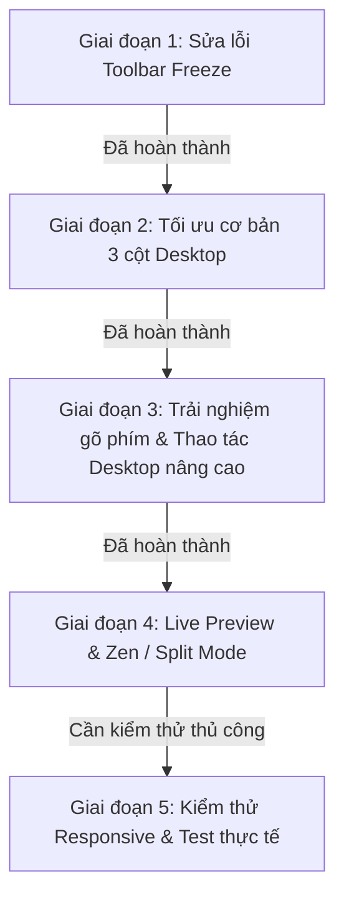

# Báo Cáo Tiến Độ & Kế Hoạch Tối Ưu Giao Diện Chỉnh Sửa Bản Thảo (Chapter Editor)

**Cập nhật lần cuối:** 09/10/2026  
**File mục tiêu chính:** [`src/components/author/chapter-editor.tsx`](file:///d:/Vinh_update/src/components/author/chapter-editor.tsx), [`src/components/author/works-sidebar.tsx`](file:///d:/Vinh_update/src/components/author/works-sidebar.tsx), [`src/components/author/publish-panel.tsx`](file:///d:/Vinh_update/src/components/author/publish-panel.tsx)

---

## 1. Tóm tắt hiện trạng quy trình

---

## 2. Các bước ĐÃ HOÀN THÀNH (Done ✅)

### Bước 1: Freeze Toolbar (Ghim thanh công cụ cố định khi cuộn)
- **Vấn đề cũ:** Thanh công cụ nằm bên trong thẻ cuộn `
`. Do đó khi tác giả cuộn xuống dưới trang văn bản dài, thanh công cụ bị trôi theo nội dung và biến mất khỏi tầm mắt.
- **Giải pháp đã thực hiện:**
  - Tách toàn bộ cụm Header + Toolbar ra khỏi vùng cuộn `scrollerRef`.
  - Đặt Toolbar thành một khối Header độc lập nằm phía trên container nội dung.
  - Xử lý chuyển đổi linh hoạt: Khi ở chế độ thường dùng `sticky top-0`, khi bật **Chế độ tập trung (Focus Mode)** chuyển sang `relative` (do container cha đã là `fixed inset-0 flex flex-col`).
  - Thêm hiệu ứng kính mờ `bg-surface-warm/95 backdrop-blur-sm shadow-[0_1px_3px_0_rgba(0,0,0,0.06)]` giúp phân tách chuyên nghiệp và sang trọng hơn.

### Bước 2: Tối ưu khả năng hiển thị trên màn hình Desktop & Responsive
- **Sidebar danh sách truyện ([`works-sidebar.tsx`](file:///d:/Vinh_update/src/components/author/works-sidebar.tsx)):**
  - Thêm `lg:overflow-y-auto` để sidebar trên màn hình lớn có thể tự cuộn độc lập khi tác giả có nhiều tác phẩm/bản thảo, không còn kéo lệch layout tổng thể.
- **Thanh trạng thái & nút thao tác:**
  - Ẩn bớt nhãn chữ không cần thiết trên mobile (`hidden sm:inline`), tối ưu không gian nút bấm.
  - Link "Xem trang truyện" hiển thị thông minh trên Desktop (`hidden lg:flex`), tránh làm chật chội trên thiết bị màn hình nhỏ.
  - Giảm chiều cao thanh công cụ từ `min-h-10` xuống `min-h-9` với padding gọn gàng hơn (`py-1`), tăng diện tích hiển thị vùng soạn thảo.
- **Kiểm tra TypeScript:** `npx tsc --noEmit` đã chạy và kiểm tra toàn bộ project (Exit code 0, không có lỗi type).

---

## 3. Bước 3–4: ĐÃ HOÀN THÀNH (Done ✅, 09/10/2026)

### Bước 3: Nâng cao trải nghiệm soạn thảo trên Desktop
- [x] **Phím tắt:** `Ctrl + B` / `Ctrl + I` / `Ctrl + Z` / `Ctrl + Shift + Z`, `Ctrl + Y` đã có từ trước. `Ctrl + S` nay bắt ở cấp khung soạn (không chỉ trong ô nội dung) nên lưu được cả khi con trỏ ở ô tên chương. Tooltip có phím tắt đã có sẵn trên các nút toolbar tương ứng; danh sách đầy đủ ở nút "Phím tắt".
- [x] **Độ rộng trang viết:** nút "Trang rộng / Trang chuẩn" ở header. Chuẩn = 660px (giá trị thực tế, không phải `max-w-3xl`), Rộng = hết khung. Lưu trên trình duyệt (`vinh_editor_layout_v1`, `src/lib/authoring/toolbar-prefs.ts`).
- [x] **Thanh trạng thái chân trang:** số chữ · thời gian đọc · trạng thái lưu (kèm giờ lưu), dính đáy khung soạn ở mọi kích thước màn hình. Trạng thái lưu đã chuyển hẳn từ header xuống đây để không hiện 2 lần.

### Bước 4: Chế độ xem trước song song (Split View)
- [x] Nút "Xem trước" ở header chia đôi: trái soạn, phải hiển thị như độc giả (`src/components/author/chapter-preview.tsx`), dùng chung `chapter-format.ts` với `reader.tsx` (tiêu đề, trích dẫn, ngắt cảnh, đậm/nghiêng, font Lora, giãn dòng 2).
- [x] Cỡ chữ xem trước A−/A+ (15–26px, giống trang đọc). Bản xem trước tự cuộn và tô đoạn đang có con trỏ.
- **Khác so với kế hoạch ban đầu:** không làm tuỳ chọn serif/sans-serif, căn lề, thụt đầu dòng vì trang đọc thật không có các tuỳ chọn này — thêm vào bản xem trước sẽ hiển thị sai so với độc giả. Ảnh thiết kế chỉ hiện ô giữ chỗ "Ảnh thiết kế".
- **Mốc màn hình:** nút Trang rộng / Xem trước chỉ hiện từ 1280px (`xl`) ở chế độ thường (cột soạn kẹp giữa 2 sidebar, ở 1024px chỉ còn ~440px), và từ 1024px (`lg`) khi bật chế độ tập trung. Dưới mốc đó bố cục giữ nguyên như cũ. Link "Xem trang truyện" cũng chuyển sang chỉ hiện từ `xl` để header không chật.

### Kiểm tra đã chạy
- `npx tsc --noEmit`, `npx eslint` các file đã sửa, `npx vitest run` (thêm test `normalizeLayout` trong `toolbar-prefs.test.ts`), `npm run build` — đều qua.

## 4. CÒN LẠI (To-Do 📋)

### Bước 5: Kiểm thử thực tế trên trình duyệt (cần người kiểm, phải đăng nhập tài khoản tác giả)
- [ ] Mobile (375px): thanh chân trang dính đáy, không che chữ khi bàn phím ảo mở; không có nút Trang rộng / Xem trước.
- [ ] Tablet (768px) và Laptop (1366px): header không vỡ dòng xấu; ở 1366px có nút Trang rộng / Xem trước.
- [ ] Desktop (1920px): bật Xem trước — 2 cột cuộn độc lập, bản xem trước theo đoạn đang gõ; bật Trang rộng — ô nội dung giãn đúng chiều cao, không bị cắt chữ.
- [ ] Focus Mode (Ctrl + Shift + F / Esc): vào/ra không vỡ thanh công cụ; Xem trước dùng được trong chế độ tập trung từ 1024px.
- [ ] Ctrl + S khi con trỏ ở ô tên chương → lưu.
