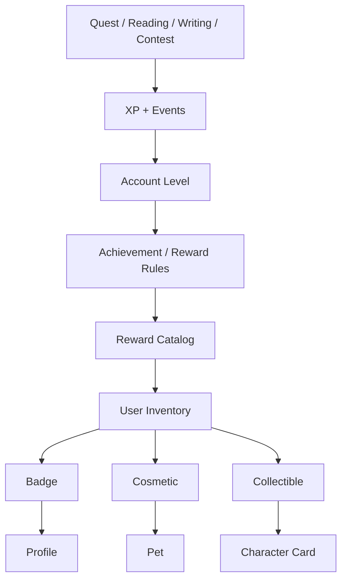

**# Hiện trạng tính năng web Vịnh và hướng phát triển**


Ngày rà soát: 25/09/2026.


Tài liệu này làm mốc tham chiếu nghiệp vụ trước khi phát triển tiếp, ưu tiên không gian viết truyện. Căn cứ là mã nguồn web, API, schema và migrations trong workspace tại thời điểm rà soát. Chưa kiểm thử website đang triển khai, chưa xác nhận migrations đã chạy trên database production, chưa thực hiện thanh toán thật. “Đã có” bên dưới nghĩa là đã có triển khai trong mã nguồn; không đồng nghĩa đã nghiệm thu vận hành.


Các mục “đề xuất” là hướng phát triển, chưa phải tính năng hiện tại. Các điểm chưa thấy triển khai được giới hạn trong phạm vi mã nguồn đã rà soát. Tài liệu mobile cũ chỉ dùng để tham khảo; hiện trạng dưới đây được đối chiếu lại với code, gồm thay đổi xóa/sắp xếp chương ngày 25/09.


**## 1. Nhận định tổng quan**


Vịnh hiện có nền tảng đăng và đọc truyện, kết nối người sáng tạo, audio, thiết kế, dịch vụ commission, nhiệm vụ và quản trị. Không gian tác giả đã hỗ trợ quy trình từ tạo truyện, nhập bản thảo, viết chương đến xuất bản và gắn tài nguyên.


Phần còn mỏng là **\*\*công cụ hỗ trợ quá trình sáng tác dài hạn\*\***: hồ sơ nhân vật, quan hệ, dàn ý, tuyến truyện, thế giới truyện, lịch sử sửa, phục hồi và cộng tác biên tập. Vì vậy, hướng phù hợp là củng cố độ tin cậy của việc lưu trước, rồi mở rộng công cụ sáng tác trên dữ liệu truyện/chương/nhân vật hiện có.


Nhận xét “nhân vật mới chỉ ở mức liệt kê” đúng về độ sâu hồ sơ nhưng chưa đủ về chức năng: đã có thêm/sửa/xóa, gắn chương, theo dõi và bình chọn; chưa có hệ thống xây dựng nhân vật hoàn chỉnh.


**## 2. Bản đồ tính năng toàn web**


\| Nhóm | Chức năng hiện có trong mã nguồn | Giới hạn và lưu ý |

\|---|---|---|

\| Trang chủ, khám phá | Truyện mới, nội dung nổi bật, nhóm thể loại, gợi ý, khu vực audio, lối vào sáng tác và các khu nội dung | Có các truy vấn dữ liệu thật; không coi mọi khối giới thiệu/marketing là chức năng nghiệp vụ đã hoàn thiện |

\| Tìm kiếm, xếp hạng | Tìm truyện, audio, thiết kế; duyệt truyện theo thể loại; bảng xếp hạng truyện và gợi ý truyện | Chưa phải bộ phân tích độc giả dành cho tác giả |

\| Trang truyện | Bìa, tên, tóm tắt, tác giả hiển thị, phân loại/tag, trạng thái, danh sách chương, nhân vật, hành động đọc/theo dõi/chia sẻ | Trạng thái công khai được suy ra theo chương; không phải tác giả chọn tự do một nhãn trạng thái |

\| Đọc truyện | Chọn chương, chương trước/sau, chỉnh cỡ chữ/giãn dòng/màu nền; lưu vị trí theo đoạn, đọc tiếp | Nội dung hiện là văn bản chia đoạn; chưa có bộ dựng Markdown đầy đủ tương ứng với thanh công cụ viết |

\| Tương tác đọc | Bình luận theo đoạn và trả lời, highlight riêng tư, bình chọn chương, bình chọn nhân vật/mẫu hình, theo dõi tác giả/nhân vật, danh sách đọc, chia sẻ | Gắn với quyền đọc chương, lịch sử đọc, nhiệm vụ và thành tựu; thay đổi editor có thể ảnh hưởng vị trí neo |

\| Quyền đọc, mua chương | Chương miễn phí/trả phí, kiểm tra giao dịch mua; khách xem trước một phần nội dung chữ | Tỉ lệ xem trước khoảng 30% theo số đoạn, làm tròn; chương chỉ một đoạn được trả nguyên đoạn. Chương trả phí chưa mua không dùng preview này |

\| Không gian tác giả | Danh sách tác phẩm, tạo/sửa truyện, quản lý chương, nhập bản thảo, bìa, nhân vật, giá, độc quyền, audio, chia sẻ bản thảo | Phân tích chi tiết ở mục 3–6 |

\| Audio | Thư viện, tìm kiếm, người thu âm, tiếp tục nghe, trình phát/mini-player, hàng đợi, tốc độ, hẹn giờ; vị trí nghe/lượt phát; tải lên và quản lý bản thu, bình luận, link liên kết chương | Có hai cơ chế audio liên quan đến chương. Giá audio đơn giản chưa tương đương luồng mua/quyền nghe hoàn chỉnh |

\| Thiết kế/minh họa | Thư viện, đăng ảnh, quản lý tác phẩm, album, nhiều ảnh, nháp/xuất bản, thích/bình luận/chia sẻ; link dùng làm bìa hoặc ảnh trong chương | Liên kết tài nguyên và quyền tác phẩm phải được giữ khi thay đổi quản lý file |

\| Tài khoản | Đăng ký, đăng nhập, OTP, xác nhận, quên/đặt lại mật khẩu, đăng xuất | Có kiểm tra thông tin đăng ký và tác vụ dọn tài khoản chưa xác nhận; cấu hình email cần được xác nhận riêng trên môi trường chạy |

\| Hồ sơ | Nickname, giới thiệu, avatar/bìa, thông tin hợp đồng, CCCD/xác minh, ngân hàng, theo dõi, hội thoại, dịch vụ, cam kết | Dữ liệu hồ sơ công khai khác dữ liệu định danh và thanh toán riêng tư |

\| Kết nối | Danh bạ người sáng tạo, hồ sơ, theo dõi, xem gói dịch vụ và bắt đầu đặt dịch vụ | Nối trực tiếp với đơn hàng, tin nhắn và các điều kiện nhận việc |

\| Tin nhắn, thông báo | Hội thoại, gửi/đọc tin, tải tin cũ, realtime, cửa sổ chat, thẻ đơn hàng; hòm thư kiểm duyệt; thông báo và đánh dấu đã đọc | Không suy ra đã có push trình duyệt chỉ từ realtime/thông báo trong web |

\| Dịch vụ | Tạo/sửa gói, nhiều mức giá, phân loại dịch vụ, mẫu sản phẩm, quyền sử dụng, riêng tư, hoàn tiền, hạn mức, nhận/tạm ngừng commission | Điều kiện nhận đơn và cam kết liên quan được dùng lại trong các luồng đặt việc |

\| Đơn hàng | Phạm vi công việc, brief, đặt cọc, bản nháp, yêu cầu sửa/duyệt, bàn giao, nghiệm thu; file gốc, gắn truyện, thỏa thuận tên tác giả; hủy/hoàn tiền, mất liên lạc, tranh chấp, nhật ký | Đây là một vòng đời nghiệp vụ riêng, không được thay thế bằng cách cấp quyền sửa truyện trực tiếp |

\| Ví và giao dịch | Backend số dư, sổ giao dịch, mua chương, nạp tiền/webhook, rút tiền/callback, quyết toán khoản chờ | UI nạp token còn dùng số dư/lịch sử mẫu, nút thanh toán mở thông báo thành công. Backend nạp có ZaloPay nhưng UI chưa nối đầy đủ. Rút tiền chưa có adapter khởi tạo chi trả thật |

\| Nhiệm vụ, chuỗi ngày, thành tựu | Nhiệm vụ theo vai trò, tiến độ, đổi/nhận thưởng; sự kiện đọc; chuỗi ngày và mốc thưởng; thành tựu đọc/sáng tạo/theo dõi nhân vật | Ba cơ chế liên quan nhưng riêng biệt. Backend cứu chuỗi chưa có luồng UI đầy đủ được xác nhận |

\| Cam kết, văn bản | Xem và xác nhận văn bản theo phiên bản, điền thông tin các bên, kiểm tra thông tin hợp đồng; thỏa thuận riêng đơn hàng | Nhãn điều kiện trong giao diện không tự chứng minh mọi điều kiện đã được cưỡng chế ở backend |

\| Quản trị | Tổng quan, người dùng, nội dung, chương, kiểm duyệt/gỡ/khôi phục, tình trạng bảo vệ bản quyền, thưởng, tranh chấp và các tác vụ dọn dữ liệu | Quyền quản trị khác quyền tác giả; không cho UI tác giả tự vượt trạng thái bị gỡ |

\| Nội dung phụ trợ | Blog, hướng dẫn làm quen, trang ra mắt/waitlist, văn bản chính sách | Blog hiện dùng dữ liệu mẫu; chưa nên mô tả là CMS/blog do người dùng xuất bản hoàn chỉnh |


Nguồn đối chiếu theo nhóm: \`src/app\`, \`src/components/reading\`, \`src/components/profile\`, \`src/components/audio-hub\`, \`src/components/design\`, \`src/components/admin\`; \`src/lib/search\`, \`src/lib/recommendations\`, \`src/lib/orders\`, \`src/lib/wallet\`, \`src/lib/quests\`; các route tương ứng trong \`src/app/api\`.


**## 3. Không gian viết truyện hiện tại**


**### 3.1. Tác phẩm và thông tin chung**


\- \`/author\`: khu tác giả, yêu cầu đăng nhập; sidebar truyện của chính người dùng, không gồm truyện đã xóa mềm.

\- \`/author/new\`: soạn truyện mới. Việc mở màn hình chưa tạo dữ liệu; lần bấm Lưu nháp/Xuất bản mới tạo truyện và chương đầu.

\- \`/author/[bookId]\`: tổng quan một truyện, danh sách chương, số chương đã đăng, tóm tắt, bìa, nhân vật và chia sẻ bản thảo.

\- \`/author/[bookId]/[chapterId]\`: soạn một chương, sửa thông tin truyện liên quan, đặt giá, xuất bản và gắn tài nguyên.

\- Có tên truyện, tóm tắt, một thể loại, nhiều tag, trạng thái độc quyền. Tóm tắt giới hạn 2.000 ký tự; tag được trim, bỏ trùng và giới hạn 20.

\- Có bìa tự sinh theo thông tin truyện, tải bìa và liên kết thiết kế làm bìa. Cần phân biệt ảnh hiển thị với bản ghi thiết kế sở hữu tài nguyên.

\- Xóa truyện là đặt \`deleted_at\`, không phải xóa ngay toàn bộ dữ liệu. Truyện đã xuất bản độc quyền bị chặn xóa; truyện có chương đã mua cũng bị chặn.


**\*\*Giới hạn:\*\*** chưa thấy quản lý bộ truyện/tập/phần, kho ý tưởng, dàn ý hoặc mục tiêu viết. “Tiếp tục viết” ở tổng quan trỏ đến chương cuối danh sách, không phải lịch sử con trỏ sáng tác riêng.


Nguồn: \`src/app/author/layout.tsx\`, \`src/components/author/book-overview\.tsx\`, \`new-work-workspace.tsx\`, \`book-cover-upload.tsx\`, \`src/app/api/authoring/books/route.ts\`, \`src/app/api/authoring/books/[bookId]/route.ts\`.


**### 3.2. Soạn nội dung chương và cách lưu**


Đã có sửa tên/nội dung, đếm chữ, ước lượng thời gian đọc; nút chèn ký hiệu đậm, nghiêng, tiêu đề nhỏ, trích dẫn, đường phân cách. Có chèn ảnh thiết kế qua link được kiểm tra, lưu dưới marker \`[[thiet-ke:\<id>]]\` và hiển thị ảnh ở trang đọc.


Editor hiện dùng textarea. Thanh công cụ chèn ký hiệu như \`\*\*\`, \`\*\`, \`##\`, \`>\` vào văn bản; reader dựng văn bản/ảnh/highlight nhưng chưa phân tích đầy đủ các ký hiệu này thành định dạng. Vì vậy, “có nút định dạng” chưa đồng nghĩa định dạng được hiển thị đúng ở đầu đọc.


\| Dữ liệu | Cách lưu hiện tại |

\|---|---|

\| Tên/nội dung chương, giá chữ, link/giá audio, cờ chương cuối | Bấm Lưu nháp hoặc Xuất bản/Cập nhật |

\| Tên truyện, tóm tắt trong màn chương | Gửi riêng khi rời ô nhập |

\| Thể loại, tag | Gửi riêng khi thay đổi |

\| Độc quyền | Gửi riêng, chờ phản hồi và báo lỗi |

\| Nhân vật xuất hiện | Gửi ngay khi chọn/bỏ chọn, thay toàn bộ tập liên kết của chương |

\| Audio liên kết | Upload/gắn/gỡ bằng thao tác riêng |

\| Công tắc bảo vệ bản quyền | Chỉ state giao diện, chưa có lưu cấu hình |


**\*\*Điểm cần cải thiện sớm:\*\*** chưa thấy tự lưu nội dung chương, phục hồi bản nháp cục bộ, lịch sử phiên bản, kiểm tra xung đột hai tab hoặc cảnh báo rời trang khi còn thay đổi. Một số hàm lưu metadata không kiểm tra \`response.ok\`, lỗi mạng bị bỏ qua; giao diện có thể hiện giá trị chưa lưu thành công. Dòng “Đã lưu” của chương không đại diện cho mọi phần trong màn hình.


Giới hạn nội dung chương hiện là 200.000 ký tự ở các API tạo/cập nhật liên quan, không phải 200.000 từ.


Nguồn: \`src/components/author/chapter-editor.tsx\`, \`author-workspace.tsx\`, \`publish-panel.tsx\`, \`src/components/reading/reader.tsx\`, \`src/lib/authoring/chapter-limits.ts\`.


**### 3.3. Quản lý chương**


\| Thao tác | Hành vi đang có | Quy tắc phải giữ |

\|---|---|---|

\| Thêm chương | Thêm chương nháp sau chỉ số thứ tự lớn nhất | Quyền chủ truyện; giữ ID chương độc lập với số thứ tự |

\| Sửa chương | Sửa nội dung/tiêu đề/giá/audio/cờ kết thúc | Chương đang bị quản trị viên gỡ không được sửa qua PATCH |

\| Xuất bản | Đặt chương công khai; đồng thời cố gắng đặt truyện công khai | Kiểm tra cam kết độc quyền; không chỉ đổi trạng thái UI |

\| Lưu nháp | Gửi \`published: false\` | Với chương đang đăng, thao tác này có nghĩa đưa về nháp, không phải lưu kín một bản sửa mới |

\| Sắp xếp | Nút lên/xuống, lưu thứ tự qua RPC | Gửi đủ mọi chương, không trùng/khác truyện; chương cuối phải đứng cuối; API nhận tối đa 1.000 ID |

\| Xóa chương | Xóa hẳn sau xác nhận | Chỉ nháp, không bị gỡ, không phải chương cuối, chưa có người mua |

\| Đánh dấu chương cuối | Mỗi truyện tối đa một chương cuối | Sau lưu không bỏ được; không xóa chương này để né quy tắc |


Xóa chương có thể kéo theo dữ liệu liên quan qua cascade; không có thùng rác chương hiện tại. Các chương phía sau không tự được đánh lại số ngay sau xóa. Sắp xếp lại thay đổi \`order_index\` nhưng không đổi ID.


**\*\*Hai khoảng trống logic cần xử lý có chủ đích:\*\***


\- Luồng thêm chương đang nối cuối và không kiểm tra rõ truyện đã có chương cuối; trong khi luồng sắp xếp bắt chương cuối đứng cuối. Cần chốt cách xử lý ngoại truyện/phần tiếp theo, kiểm tra cả API và DB, thay vì chỉ khóa nút sắp xếp.

\- Chuyển chương đã mua về nháp có thể khiến người đã mua không còn đọc được qua điều kiện quyền đọc hiện tại. Luật cấm xóa chương đã mua chưa tự giải quyết quyền tiếp tục đọc khi chương bị đưa về nháp.


Nguồn: \`src/components/author/book-overview\.tsx\`, \`src/app/api/authoring/chapters/[chapterId]/route.ts\`, \`src/app/api/authoring/books/[bookId]/chapters/route.ts\`, \`chapters/order/route.ts\`, \`migrations/20260925_add_chapter_delete_and_reorder.sql\`, \`src/lib/reading/chapter-access.ts\`.


**### 3.4. Nhập bản thảo**


Đã có nhập \`.txt\`, \`.docx\` hoặc dán văn bản; xem trước danh sách chương; tạo truyện mới hoặc thêm vào truyện có sẵn. Có tách theo mốc “Chương N”, khoảng dòng trống, giữ nguyên một chương; \`.docx\` còn thử tách bằng Heading thực của Word.


\- File \`.docx\` tối đa 4 MB ở API trích xuất; không hỗ trợ \`.doc\` hoặc \`.epub\` ở route này.

\- Luồng tách văn bản giới hạn 300 chương; API thêm hàng loạt cũng giới hạn 300 chương/lần.

\- Chương nhập vào được tạo nháp, nối tiếp thứ tự hiện có.

\- Đây là trích văn bản và chia chương; không phải bảo toàn đầy đủ bố cục, ảnh và định dạng Word.

\- Tạo truyện, sửa chương đầu và thêm các chương còn lại là nhiều bước. Lỗi giữa chừng có thể để lại kết quả một phần; chưa có cơ chế giao dịch chung/chống nhập trùng hoàn chỉnh.

\- Nhánh tách theo Heading lấy nội dung sau từng Heading; cần bổ sung kiểm thử bảo toàn lời mở đầu nằm trước Heading đầu tiên và giới hạn số Heading.


Chưa thấy xuất toàn bộ bản thảo ra TXT/DOCX/EPUB, sao lưu tải xuống hoặc hoàn tác một lần nhập.


Nguồn: \`src/components/author/import-manuscript-modal.tsx\`, \`src/lib/authoring/split-chapters.ts\`, \`src/app/api/authoring/manuscripts/extract/route.ts\`.


**## 4. Quản lý nhân vật: đã có gì, thiếu gì?**


**### 4.1. Đã có**


Một nhân vật thuộc một truyện. Hồ sơ hiện gồm ID, tên, \`role\`, một \`trope\` tùy chọn và thời điểm tạo.


\- Thêm, sửa tên/phân loại/mẫu hình, xóa nhân vật tại tổng quan truyện.

\- \`role\`: chính diện (\`hero\`), phản diện (\`villain\`), trung lập (\`neutral\`). Đây là phân loại tính chất, **\*\*không phải\*\*** chính/phụ/quần chúng.

\- \`trope\`: một chuỗi nhập tự do như “Ma vương”, “Trượng nghĩa”; chưa phải danh mục chuẩn hoặc nhiều tag.

\- Gắn/bỏ nhân vật xuất hiện trong chương bằng checklist; không tự phát hiện từ nội dung.

\- Trang truyện có danh sách nhân vật và theo dõi/bỏ theo dõi.

\- Trong chương, độc giả chọn một nhân vật làm mẫu hình yêu thích; một lựa chọn/người/chương, đổi người được cập nhật thay lựa chọn cũ.

\- Theo dõi và việc đọc các chương có nhân vật được dùng cho nhiệm vụ/thành tựu.


**\*\*Xóa hiện tại có tác động lớn hơn xóa một dòng hiển thị:\*\*** các bảng liên kết chương, theo dõi và bình chọn tham chiếu nhân vật với \`ON DELETE CASCADE\`. Vì vậy không nên dùng xóa/tạo lại để đổi cấu trúc hồ sơ hoặc “hợp nhất” hai nhân vật.


Nguồn: \`src/components/author/character-manager.tsx\`, \`chapter-characters-panel.tsx\`, \`src/components/story/character-list.tsx\`, \`src/components/reading/trope-vote-panel.tsx\`, \`migrations/20260919_add_characters.sql\`.


**### 4.2. Chưa thấy triển khai**


\| Nhu cầu sáng tác | Hiện tại | Hướng bổ sung |

\|---|---|---|

\| Nhớ chi tiết nhân vật | Chỉ tên, role, trope | Bí danh, chân dung, ngoại hình, tính cách, động cơ, điểm yếu, quá khứ, ghi chú |

\| Phân biệt chính/phụ | Không có trường riêng | Thêm mức độ quan trọng; giữ nguyên ý nghĩa role cũ |

\| Quan hệ | Không có mô hình quan hệ | Quan hệ có hướng/hai chiều, mô tả và giai đoạn áp dụng |

\| Diễn biến | Chỉ biết được gắn ở chương nào | Mốc phát triển, thay đổi động cơ/trạng thái theo chương |

\| Tránh lộ cốt truyện | Chưa có hồ sơ riêng/công khai theo trường | Ghi chú tác giả mặc định riêng tư; thông tin công khai chọn rõ, có mốc tiết lộ |

\| Kiểm tra tính nhất quán | Không có công cụ chuyên biệt | Tìm tên/bí danh, cảnh báo mô tả mâu thuẫn để tác giả duyệt |

\| Tra cứu khi viết | Checklist là chính | Bảng tra cứu nhân vật bên cạnh editor, tìm kiếm/lọc và danh sách chương xuất hiện |


**\*\*Thiết kế tương thích đề xuất:\*\*** giữ \`characters.id\` và ba giá trị role; thêm trường tùy chọn hoặc bảng riêng. Không đưa ghi chú kín vào bảng đang có policy đọc công khai theo truyện. Quan hệ mới tham chiếu ID nhân vật, không tên. Nếu mở rộng trope thành nhiều tag, vẫn đọc được chuỗi trope cũ và xác định rõ bình chọn đang chọn nhân vật hay chọn một nhãn cụ thể. Ưu tiên lưu trữ/ẩn nhân vật thay cho xóa khi đã có tương tác.


**## 5. Xuất bản, trạng thái và quyền**


**### 5.1. Các trạng thái không được gộp**


\| Khái niệm | Căn cứ hiện tại | Ý nghĩa |

\|---|---|---|

\| Truyện công khai | \`books.published\` | Truyện được xuất hiện trong các luồng công khai phù hợp |

\| Chương công khai | \`chapters.published\` | Chương được đăng; vẫn còn kiểm tra bị gỡ, quyền đọc và truyện cha |

\| Truyện hoàn thành | Có chương cuối đã xuất bản | Trạng thái hiển thị với độc giả |

\| Tạm ngưng | Không có chương cuối công khai và chương công khai gần nhất có \`created_at\` quá 3 tháng | Suy ra lúc hiển thị, không phải thao tác tác giả xin tạm ngưng |

\| Hoàn thiện bản thảo | \`books.finalized_at\` | Khóa việc thay đổi quyền chia sẻ bản thảo; không tự mang nghĩa khóa nội dung hoặc đăng chương cuối |

\| Độc quyền | \`books.is_exclusive\` | Thuộc toàn truyện, không thuộc từng chương |

\| Bị gỡ | \`chapters.removed_at\` và dữ liệu kiểm duyệt | Quyền can thiệp của quản trị; tác giả không được tự bỏ cờ qua thao tác lưu |

\| Xóa truyện | \`books.deleted_at\` | Xóa mềm, khác gỡ một chương và khác đưa chương về nháp |


Trạng thái tạm ngưng dùng ngày **\*\*tạo\*\*** chương công khai gần nhất, không phải ngày xuất bản thực tế. Một chương để nháp lâu rồi mới đăng có thể làm tín hiệu hoạt động không đúng kỳ vọng. Đổi sang \`published_at\` cần bổ sung dữ liệu và quy tắc chuyển đổi rõ ràng.


Xuất bản chương và đặt truyện công khai hiện là các lệnh riêng; lỗi cập nhật truyện có thể chỉ được ghi log. Đưa tất cả chương về nháp không có nhánh tự động đưa truyện về chưa công khai trong PATCH chương hiện tại. Cần kiểm thử trạng thái truyện công khai nhưng không có chương đọc được.


Nguồn: \`src/lib/story/status.ts\`, \`src/app/api/authoring/chapters/[chapterId]/route.ts\`, \`src/app/api/authoring/books/[bookId]/finalize/route.ts\`.


**### 5.2. Độc quyền và cam kết**


Tạo truyện mặc định độc quyền nếu request không chỉ định khác. Bật độc quyền và xuất bản truyện độc quyền có kiểm tra xác nhận văn bản hiện hành. Khi đã xuất bản độc quyền quá 3 ngày tính từ mốc xuất bản, tác giả không chuyển về tự do được theo luật hiện có; quản trị có luồng riêng.


Không chuyển độc quyền xuống cấp chương chỉ vì công tắc đang đặt cạnh editor chương. Khi thêm lịch xuất bản/tự động xuất bản, phải kiểm tra cam kết ở thời điểm thực thi, không chỉ lúc đặt lịch.


**### 5.3. Chia sẻ bản thảo và viết thuê**


Đã có cấp quyền xem bản thảo cho đúng một tài khoản, gỡ quyền và cấp lại trước khi Hoàn thiện. Người được cấp xem qua \`/ban-thao/[bookId]\`, không cần truyện đã công khai. Hoàn thiện khóa khả năng gỡ/cấp lại; người đang có quyền vẫn đọc được.


Đây là **\*\*quyền xem\*\***, chưa phải đồng tác giả, quyền sửa, bình luận biên tập hay theo dõi thay đổi. API đọc bản thảo trả dữ liệu nội dung, nên giao diện hạn chế copy không làm nội dung trở thành dữ liệu không thể lấy ra.


Viết thuê/commission còn có gắn truyện vào đơn, thỏa thuận tên tác giả và thông tin tác giả hiển thị. Không dùng tên tác giả hiển thị để thay quyền sở hữu kỹ thuật \`author_id\`, và không suy ra người được xem bản thảo là chủ đơn hoặc người được quyền sửa.


Nguồn: \`src/components/author/share-manuscript-panel.tsx\`, các route \`share\`, \`manuscript\`, \`finalize\`; \`src/lib/orders/author-name-agreement-service.ts\`, \`migrations/20260901_add_ghostwriting_authorship.sql\`.


**### 5.4. Audio và bảo vệ nội dung**


Hai hệ audio cùng tồn tại:


1\. \`chapters.audio_url\` và \`audio_price\`: link đơn giản, giá niêm yết riêng. Code ghi rõ chưa cưỡng chế chặn nghe theo giá.

2\. \`audio_narrations\` + \`chapter_audio_links\`: bản thu có người thu âm và metadata; tác giả upload/gắn, nhận link chia sẻ có token hoặc gỡ liên kết.


Không gộp hai hệ bằng cách sao chép URL và bỏ chủ sở hữu/liên kết. Nếu triển khai bán audio cần xác định quyền mua, người nhận doanh thu, quyền truy cập file và quan hệ với mua chương chữ.


Khối Bảo vệ bản quyền trong editor có ba công tắc watermark, render ảnh và NFT nhưng chỉ lưu state React. Dòng token Polygon là nội dung cố định; chưa có bằng chứng đây là luồng đúc NFT. Reader có cơ chế watermark/hạn chế thao tác/phát hiện và xử lý tín hiệu sao chép hoặc chụp; điều đó không chứng minh ba công tắc trên đang điều khiển hệ thống. Nội dung chữ vẫn được dựng bằng phần tử văn bản, không phải toàn bộ render thành ảnh.


Rào nghe thử audio cho khách dựa trên player với URL công khai, nên không tương đương kiểm soát truy cập file ở server. Không hứa bảo vệ tuyệt đối hay thu phí audio hoàn chỉnh trước khi giải quyết mô hình quyền.


Nguồn: \`src/components/author/copyright-settings.tsx\`, \`chapter-audio-panel.tsx\`, \`src/app/api/authoring/books/route.ts\`, \`src/lib/reading/access-gate.ts\`, \`src/components/reading/reader.tsx\`, \`src/lib/reading/capture-detection.ts\`.


**## 6. Những ràng buộc cần giữ khi phát triển tiếp**


\| Khu vực thay đổi | Liên kết cũ dễ bị ảnh hưởng | Nguyên tắc tương thích |

\|---|---|---|

\| Hồ sơ nhân vật | Theo dõi, bình chọn, nhiệm vụ/thành tựu | Giữ ID; không đổi nghĩa role; không xóa/tạo lại để nâng cấp hồ sơ |

\| Dữ liệu nhân vật riêng tư | Policy nhân vật hiện cho đọc theo truyện công khai | Bảng riêng hoặc API/policy riêng; không chỉ ẩn ô trên UI |

\| Editor/định dạng | Bình luận theo \`paragraph_index\`, highlight theo vị trí ký tự, tiến độ đọc | Có phiên bản nội dung và chiến lược chuyển neo; dữ liệu không khớp phải được đánh dấu, không gắn nhầm |

\| Dàn ý/phần/hồi | Thứ tự chương, liên kết đọc, chương cuối | Thêm lớp tổ chức; không đổi ID hay mặc định tạo chương công khai từ một mục dàn ý |

\| Sắp xếp/xóa chương | Lịch sử đọc, thành tựu đọc liên tiếp dùng thứ tự, giao dịch mua | Kiểm tra tác động lên phép tính cũ; giữ lịch sử tài chính và quyền mua |

\| Lưu tự động | Lưu nháp hiện đồng thời đặt \`published: false\` | Autosave phải lưu bản sửa riêng hoặc giữ trạng thái; không dùng nguyên hành động Lưu nháp trên chương đã đăng |

\| Xuất bản/đặt lịch | Cam kết, cờ bị gỡ, truyện công khai, phần thưởng | Giao dịch nhất quán, chống thực thi lặp, kiểm tra quyền lúc chạy |

\| Hoàn thiện/cộng tác | Một grant hoạt động, grant khóa sau finalize | Không âm thầm mở lại quyền đã khóa khi thêm nhiều cộng tác viên |

\| Audio/minh họa/bìa | Chủ sở hữu tài nguyên, token liên kết, đơn hàng | Tách quyền sở hữu khỏi quyền sử dụng/gắn tài nguyên |

\| Metadata tác giả | \`author_id\`, tên hiển thị, thỏa thuận viết thuê | Quyền sửa dựa vào chủ sở hữu/quyền cấp rõ ràng, không dựa vào tên hiển thị |

\| API dùng chung | Web cookie, mobile Bearer, RLS, service-role | Dùng chung nghiệp vụ, tự kiểm quyền khi dùng service-role; không tạo luật khác nhau giữa web/mobile |

\| Triển khai | Schema, migrations, kiểu TypeScript, UI | Có migration dữ liệu cũ và kiểm thử quyền; không coi có file SQL là đã chạy SQL |


Sơ đồ quan hệ để định hướng thay đổi:


\`\`\`mermaid

flowchart LR

  Book[Truyện] --> Chapter[Chương]

  Book --> Character[Nhân vật]

  Chapter --> Appearance[Liên kết nhân vật xuất hiện]

  Character --> Appearance

  Character --> Follow[Theo dõi nhân vật]

  Chapter --> Vote[Bình chọn nhân vật theo chương]

  Character --> Vote

  Chapter --> ReaderData[Bình luận / highlight / tiến độ]

  Chapter --> Purchase[Giao dịch mua chương]

  Chapter --> Audio[Liên kết bản thu]

  Book --> Grant[Quyền xem bản thảo]

  Book --> Order[Liên kết đơn viết thuê / tên hiển thị]

\`\`\`


**## 7. Đề xuất cải thiện theo thứ tự**


**### Ưu tiên 0 — tin cậy khi viết và xuất bản**


\| Hạng mục | Cách cải thiện | Điều kiện nghiệm thu chính |

\|---|---|---|

\| Trạng thái lưu thống nhất | Báo chưa lưu/đang lưu/đã lưu/lỗi theo dữ liệu; xử lý lỗi metadata | Mất mạng hoặc API 4xx/5xx không báo đã lưu; thử lại không mất nội dung |

\| Tự lưu và phục hồi | Nháp cục bộ, tự lưu có trì hoãn, cảnh báo rời trang; phát hiện phiên bản thay đổi từ tab khác | Đóng/mở lại khôi phục được; hai tab không âm thầm ghi đè; chương đang đăng không bị tự ẩn |

\| Lịch sử phiên bản | Lưu snapshot, xem khác biệt, phục hồi thành một phiên bản mới | Giữ bản công khai cũ đến khi bấm cập nhật; phục hồi không phá bình luận/highlight |

\| Làm rõ trạng thái | Tách nhãn “Kết thúc truyện”, “Khóa chia sẻ bản thảo”, “Đưa về nháp” | Tác giả biết hậu quả trước hành động; có xử lý chương đã mua và ngoại truyện |

\| Xuất bản/nhập nhất quán | Giao dịch DB hoặc trạng thái công việc có thể tiếp tục; khóa chống gửi lặp | Lỗi giữa chừng không tạo truyện/chương trùng; không thành công giả khi truyện chưa công khai |

\| Sửa kỳ vọng giao diện | Nối đúng định dạng editor–reader; bỏ/đổi nhãn công tắc chưa hoạt động | Bản xem trước khớp bản đọc; không hiện chứng nhận hoặc thanh toán thành công khi chưa có kết quả thật |


**### Ưu tiên 1 — quản lý nhân vật thực sự hữu ích**


Làm một màn hồ sơ nhân vật và bảng tra cứu ngay trong editor trước khi làm đồ thị quan hệ phức tạp. Phiên bản đầu nên gồm tên/bí danh, vai trò chính–phụ riêng, ngoại hình, tính cách, động cơ, ghi chú riêng, mô tả công khai và danh sách chương đã gắn.


Tiếp theo mới thêm quan hệ giữa nhân vật, mốc phát triển theo chương và thông tin chống tiết lộ nội dung. Mọi gợi ý tự phát hiện tên/quan hệ chỉ là gợi ý để tác giả xác nhận. Không tự thay liên kết chính thức vì liên kết đó ảnh hưởng bình chọn và thành tựu.


Nghiệm thu: toàn bộ nhân vật cũ giữ ID và lượt theo dõi; mở hồ sơ cũ không thiếu dữ liệu bắt buộc; ghi chú kín không xuất hiện trong API công khai; sửa tên không làm mất liên kết chương.


**### Ưu tiên 2 — dàn ý và quản lý truyện dài**


\- Thêm phần/hồi và dàn ý chương, tóm tắt nội bộ, ghi chú cần sửa; phân biệt rõ tóm tắt nội bộ với tóm tắt công khai.

\- Thêm trạng thái biên tập riêng: ý tưởng, đang viết, cần sửa, sẵn sàng đăng. Không dùng chúng thay \`published\` hoặc cờ kiểm duyệt.

\- Tìm kiếm trong bản thảo, lọc chương theo nhân vật/trạng thái; thao tác hàng loạt có xem trước hậu quả.

\- Thế giới truyện: địa điểm, tổ chức, vật phẩm, quy tắc; liên kết nhân vật và chương bằng ID.

\- Dòng thời gian sự kiện tách thời gian trong truyện khỏi thứ tự chương xuất bản.

\- Xuất/sao lưu bản thảo và báo cáo lỗi nhập, bao gồm lời mở đầu, giới hạn chương và phần đã nhập thành công.


Nghiệm thu: truyện cũ không có phần/hồi vẫn mở bình thường; đổi dàn ý không đổi URL chương, quyền mua hoặc thứ tự xuất bản ngoài ý muốn.


**### Ưu tiên 3 — xuất bản chuyên nghiệp và cộng tác**


\- Đặt lịch xuất bản theo múi giờ, hàng đợi chương; kiểm tra lại cam kết và kiểm duyệt khi đến giờ.

\- Preview như độc giả, gồm giá, ảnh, audio, quyền đọc và thông tin nhân vật công khai.

\- Biên tập viên/người đọc thử có quyền riêng: xem, góp ý, đề xuất sửa; giữ tác giả duyệt xuất bản. Thiết kế việc chuyển từ grant cũ đã khóa trước khi mở cộng tác nhiều người.

\- Thống kê tác giả theo chương: người đọc, đọc tiếp, hoàn thành, bình luận và doanh thu. Định nghĩa dữ liệu trước, tránh dùng lượt tải trang như số người đọc hoàn thành.

\- Hoàn thiện nạp/rút và mô hình bán audio nếu thương mại hóa là ưu tiên; phần này có thể chạy song song với công cụ sáng tác sau khi chốt nghiệp vụ.


Chưa ưu tiên AI tự viết hoặc tự sửa hàng loạt trước các bước trên. Nếu bổ sung AI, đầu ra nên là đề xuất có thể duyệt, so sánh và hoàn tác; không tự sửa dữ kiện nhân vật hay bản đã xuất bản.


**## 8. Các quyết định sản phẩm cần chốt khi triển khai**


1\. Nhân vật phục vụ tác giả, độc giả hay cả hai? Đề xuất phục vụ cả hai, nhưng dữ liệu soạn thảo mặc định riêng tư.

2\. Chương cuối có cho sửa sai/đăng ngoại truyện không? Hiện tại cờ không đảo được; muốn đổi cần nghiệp vụ và migration rõ ràng.

3\. Người đã mua được đọc bản nào nếu tác giả sửa, ẩn hoặc xóa? Cần chính sách bản công khai và lưu lịch sử tương ứng.

4\. “Hoàn thiện” nên tiếp tục chỉ khóa chia sẻ hay trở thành mốc nghiệm thu? Nếu mở rộng phải dùng trạng thái mới, không đổi nghĩa dữ liệu cũ âm thầm.

5\. Chọn định dạng lưu nội dung nào cho editor mới? Cần giữ marker ảnh, đoạn, highlight và bản thảo cũ đọc được.

6\. Audio bán riêng hay đi kèm chương chữ? Ai sở hữu, ai được gắn và ai nhận doanh thu?


Các câu hỏi này là đầu vào cho từng đợt phát triển, không phải điều kiện để sử dụng tài liệu hiện trạng.


**## 9. Bộ kiểm tra hồi quy cần có cho lần phát triển tiếp**


\- Truyện/chương/nhân vật cũ mở được sau migration, ID và liên kết giữ nguyên.

\- Chủ truyện sửa được, người khác không sửa được; người xem bản thảo không có thêm quyền sửa.

\- Nháp, bị gỡ, xóa mềm, trả phí và grant bị thu hồi đều tuân thủ đúng quyền truy cập.

\- Lưu khi mất mạng, mở hai tab, hết phiên đăng nhập và rời trang không làm mất nội dung âm thầm.

\- Định dạng, ảnh, bình luận, highlight và tiến độ vẫn khớp sau chỉnh nội dung/sắp xếp.

\- Không xóa chương đã mua/chương cuối/chương bị gỡ; không mất giao dịch khi xóa truyện.

\- Xuất bản lại, retry nhập và retry callback không nhân đôi dữ liệu hoặc phần thưởng.

\- Chương cuối, Hoàn thiện và độc quyền vẫn là ba khái niệm riêng.

\- Kiểm thử tương đương trên web và API mobile dùng chung; xác nhận migration đã chạy trước nghiệm thu.


**## 10. Điểm vào mã nguồn cho người phát triển sau**


\| Mục đích | Tệp/thư mục |

\|---|---|

\| Trang và bố cục tác giả | \`src/app/author\` |

\| Tổng quan, chương, nhân vật, nhập và chia sẻ | \`src/components/author\` |

\| API nghiệp vụ sáng tác | \`src/app/api/authoring\` |

\| Giới hạn, tách chương, độc quyền, dữ liệu workspace | \`src/lib/authoring\` |

\| Trạng thái truyện | \`src/lib/story/status.ts\` |

\| Đầu đọc và tương tác | \`src/components/reading\`, \`src/lib/reading\` |

\| Schema và kiểu dữ liệu | \`docs/supabase/schema.sql\`, \`src/lib/supabase/types.ts\` |

\| Nhân vật và quan hệ hiện tại | \`migrations/20260919_add_characters.sql\` |

\| Xóa/sắp xếp chương mới | \`migrations/20260925_add_chapter_delete_and_reorder.sql\` |

\| SQL kiểm thử xóa/sắp xếp | \`docs/supabase/tests/20260925_chapter_delete_and_reorder.test.sql\` |

\| Chia sẻ và viết thuê | \`migrations/20260901_add_manuscript_share.sql\`, \`migrations/20260901_add_ghostwriting_authorship.sql\` |

\| Dịch vụ, đơn hàng | \`src/lib/orders\`, \`src/app/api/orders\`, \`src/components/profile/order-card.tsx\` |

\| Ví: phần thật và phần chưa nối | \`src/lib/wallet\`, \`src/components/topup/topup-page.tsx\` |

\| Phạm vi mobile đang phát triển | \`docs/mobile-implementation-plan.md\`, \`docs/mobile-web-feature-audit.md\` |


Khi thay đổi nghiệp vụ, cập nhật đồng thời mô tả hiện trạng, ràng buộc tương thích và trạng thái triển khai trong tài liệu này. Không đánh dấu hoàn thành chỉ vì đã thêm giao diện hoặc route.

**## 11. Roadmap phát triển sản phẩm cập nhật**

Roadmap này giữ các mốc phát triển đã chốt, đồng thời bổ sung một nhánh dài hạn **Identity & Collection**. Nguyên tắc là hoàn thiện độ tin cậy, kiếm tiền và mobile trước; sau đó mới mở rộng gamification thành hệ thống tiến trình, nhận diện và sưu tập. 3D linh thú không được ưu tiên trước khi phiên bản 2D chứng minh được retention và nhu cầu trang trí/sưu tập.

| Thời gian | Mốc / phạm vi |
|---|---|
| **Giai đoạn 1 — Nền tảng** | |
| 07/10/2026 | Hoàn tất đọc, viết, audio, nhiệm vụ |
| 12/10/2026 | Mở Discord, bắt đầu mời tác giả |
| 21/10/2026 | Cuộc thi viết lần 1, vận hành thủ công để kiểm chứng nghiệp vụ |
| 31/10/2026 | Hoàn tất benchmark giá và chuẩn bị logic đề xuất giá |
| **Giai đoạn 2 — Kiếm tiền và production readiness** | |
| 15/11/2026 | Thanh toán, rút tiền, escrow, dashboard tác giả v1, đề xuất giá v1 |
| 20/11/2026 | Closed testing trên Google Play |
| 25/11/2026 | Kiểm tra bảo mật và tải hệ thống |
| 30/11/2026 | Kiểm duyệt, xóa tài khoản, trang quản trị, Google Play Billing |
| **Giai đoạn 3 — Android và nền móng Creator Tool** | |
| 10/12/2026 | Ra mắt Android trên Google Play |
| 10–31/12/2026 | Ổn định app; viết spec/schema/UX cho Character & Plot Tool |
| 15/12/2026 | Trả tiền tác giả lần đầu |
| **Giai đoạn 4 — Creator Tool, iOS và Progression Foundation** | |
| 05/01/2027 | TestFlight |
| 20/01/2027 | Nộp App Store review |
| 31/01/2027 | Character/Plot Management MVP trên web + Android; nhiệm vụ Tết được dùng như prototype Event Quest |
| 10/02/2027 | Ra mắt iOS |
| 20/02/2027 | iOS bổ sung Character Tool |
| 28/02/2027 | Account Level + XP; chuẩn hóa event phát XP/reward |
| **Giai đoạn 5 — Identity & Collection Foundation** | |
| 31/03/2027 | Achievement → Badge/Medal; bổ sung Title có thể trang bị |
| 15/04/2027 | Dashboard tác giả v2 + đề xuất giá v2 |
| 30/04/2027 | Character Tool v2 từ feedback MVP; chuẩn bị dữ liệu public/private cho Character Card |
| 31/05/2027 | Hoàn thiện tính năng cuộc thi viết |
| 15/06/2027 | Ra mắt Contest System + cuộc thi lần 2; badge/title giới hạn theo sự kiện |
| 30/06/2027 | Reward Catalog + User Inventory: badge, title, background, avatar frame, collectible; equip/display trên profile |
| 31/07/2027 | AI đề xuất giá v3; Profile Customization v1 |
| **Giai đoạn 6 — Collection & Reader Identity** | |
| 31/08/2027 | Bookshelf v2: kệ tùy chỉnh, public/private, theme/background |
| 30/09/2027 | Character Card + Character Discovery; nội dung card mở khóa theo tiến độ đọc để hạn chế spoiler |
| 31/10/2027 | Linh thú 2D MVP: pet gắn tài khoản, tăng trưởng từ XP/hành vi; cosmetic lấy từ inventory |
| 30/11/2027 | Reader Archetype v1 dựa trên telemetry; chỉ hiển thị các kết luận có ngưỡng dữ liệu đủ rõ |
| 31/12/2027 | Vịnh Wrapped / Reading Journey đầu tiên; tạo thẻ chia sẻ |
| **Giai đoạn 7 — Event, Social Expression và thử nghiệm linh thú nâng cao** | |
| Q1/2028 | Event/Season System chuẩn hóa: Event Quest → Event XP → Reward Track → collectible/cosmetic |
| Q1/2028 | Activity/share layer có kiểm soát: chia sẻ badge, bookshelf, pet, Wrapped; chưa ưu tiên social feed tổng quát |
| Q2/2028 | Linh thú 2D animated nếu MVP chứng minh được engagement |
| Sau Q2/2028 | Chỉ thử nghiệm linh thú 3D nếu dữ liệu cho thấy người dùng thực sự sử dụng pet, cosmetic và social display |

**### 11.1. Chuỗi phụ thuộc chính**




Không để từng tính năng tự tạo một hệ reward riêng. Badge, title, background, frame, pet skin và collectible phải dùng chung catalog/inventory để tránh hard-code phần thưởng theo từng feature.

**## 12. Identity, Collection và Progression System**

**### 12.1. Reward Catalog và User Inventory**

Đây là lớp nền cần làm trước profile customization, pet và event reward. Một reward nên có định danh ổn định, loại, metadata hiển thị, độ hiếm nếu cần, thời gian khả dụng và điều kiện sở hữu.

Các loại ban đầu:

- `badge` — huy hiệu/huân chương trưng bày.
- `title` — danh hiệu trang bị cạnh nickname hoặc hồ sơ.
- `profile_background` — nền hồ sơ.
- `avatar_frame` — khung avatar.
- `bookshelf_theme` — giao diện kệ sách.
- `pet` — linh thú cơ sở.
- `pet_cosmetic` — phụ kiện/skin/effect cho linh thú.
- `collectible` — vật phẩm sưu tập/event item/character card variant.

Bản ghi sở hữu cần lưu tối thiểu `user_id`, `reward_id`, `obtained_at`, `source_type`, `source_id`; trạng thái trang bị nên được mô hình hóa rõ thay vì hard-code trong từng UI. `source_type` dự kiến gồm achievement, quest, event, contest, purchase, author_reward và legacy.

**### 12.2. Achievement, Badge và Title**

Không đồng nhất ba khái niệm:

- **Achievement** ghi nhận điều kiện/progress và có thể cấp XP hoặc reward.
- **Badge/Medal** là vật phẩm nhận diện để người dùng lựa chọn trưng bày; một số badge sự kiện có thể không kiếm lại được.
- **Title** là danh hiệu ngắn người dùng chủ động trang bị, ví dụ “Kẻ đọc trong đêm”, “Người đi qua nghìn chương”, “Contest Author”.

Achievement hiện có phải được migration/tích hợp thay vì tạo hệ mới làm mất tiến độ cũ.

**### 12.3. Profile Customization**

Profile v1 có thể cho trang bị avatar frame, background, title, badge showcase và sau này linh thú. Không đưa toàn bộ inventory lên profile; người dùng chọn một tập nhỏ để trưng bày.

Mục tiêu là biến account level và achievement thành tài sản nhận diện có thể nhìn thấy, thay vì chỉ là con số trong dashboard.

**### 12.4. Bookshelf mở rộng**

Danh sách đọc có thể phát triển thành kệ sách cá nhân với các trạng thái mặc định và kệ do người dùng tự tạo. Kệ có public/private, tên/mô tả và theme. Không để thay đổi kệ ảnh hưởng quyền mua hoặc reading progress.

**### 12.5. Character Card và Character Discovery**

Character Card nên tái sử dụng dữ liệu Character Tool thay vì tạo bản sao dữ liệu nhân vật. Card có thể gồm chân dung, tên, truyện, vai trò/trope công khai, quote hoặc dữ kiện đã được tác giả cho phép công khai.

Thông tin có khả năng spoiler phải hỗ trợ `reveal_after_chapter` hoặc cơ chế tương đương. Người đọc chỉ nhìn thấy dữ liệu đã được mở khóa theo tiến độ/quyền đọc của mình. Character Card có thể có variant sự kiện nhưng không được làm thay đổi `characters.id` hoặc quan hệ follow/vote hiện tại.

**### 12.6. Linh thú**

Linh thú là lớp biểu đạt của account progression, không phải một mini-game độc lập ở phiên bản đầu.

MVP dùng 2D và cần đo ít nhất: tỷ lệ người mở trang pet, equip cosmetic, hoàn thành quest liên quan, chia sẻ/hiển thị pet và retention của nhóm sử dụng pet. Tiến hóa có thể chịu ảnh hưởng bởi level và các nhóm hành vi đọc/sáng tác, nhưng thuật toán phải minh bạch đủ để kiểm thử và không suy diễn thuộc tính nhạy cảm của người dùng.

Không đầu tư pipeline 3D trước khi 2D/animated pet chứng minh nhu cầu. Nếu lên 3D cần tính riêng ngân sách asset, rig/animation, streaming và hiệu năng web/Android/iOS.

**### 12.7. Reader Archetype**

Archetype được suy ra từ telemetry có đủ dữ liệu, ví dụ xu hướng đọc ban đêm, mức đa dạng thể loại, tỷ lệ hoàn thành hoặc xu hướng theo dõi nhân vật. Đây là nhãn giải thích hành vi trên Vịnh, không phải kết luận về tính cách ngoài đời.

Phải có ngưỡng dữ liệu tối thiểu và cho phép không hiển thị khi bằng chứng yếu. Không dùng các thuộc tính nhạy cảm hoặc suy đoán nhân khẩu học không được người dùng cung cấp.

**### 12.8. Event/Season System**

Nhiệm vụ Tết được xem là prototype cho hệ sự kiện tổng quát. Kiến trúc dài hạn:

```text
Event
  → Event Quest
  → Event XP / Progress
  → Reward Rule
  → Reward Catalog
  → User Inventory
```

Contest có thể cấp reward qua cùng hệ này nhưng kết quả chấm thi và submission vẫn thuộc Contest System; không trộn nghiệp vụ cuộc thi vào Quest System.

**### 12.9. Reading Journey và Vịnh Wrapped**

Reading Journey ghi các milestone có ý nghĩa như gia nhập, hoàn thành truyện đầu tiên, streak, contest, mốc chương hoặc evolution của pet. Wrapped là báo cáo tổng hợp theo kỳ từ dữ liệu đã có, có thể sinh share card.

Số liệu Wrapped phải dựa trên định nghĩa analytics ổn định; không biến page view thành “đã đọc” hoặc thời gian mở trang thành thời gian đọc nếu chưa có telemetry hỗ trợ.

**## 13. Nguyên tắc ưu tiên cho các tính năng mới**

Mỗi feature mới nên được kiểm tra theo bốn câu hỏi trước khi đưa vào milestone:

1. Feature có tạo thêm giá trị cho hành vi cốt lõi đọc/viết hay chỉ thêm UI?
2. Có tái sử dụng event/data/reward hiện có hay tạo một silo mới?
3. Có metric xác định được feature thành công hay thất bại không?
4. Nếu feature bị bỏ sau thử nghiệm, dữ liệu và nghiệp vụ cũ có tiếp tục hoạt động không?

Ưu tiên kiến trúc dùng chung trước cosmetic cụ thể: **event telemetry → XP/progression → reward catalog → inventory → equip/display → feature-specific presentation**.

**### 13.1. Không ưu tiên trong ngắn hạn**

- 3D linh thú trước khi pet 2D chứng minh engagement.
- Social feed tổng quát trước khi profile/collection tạo đủ nội dung có giá trị để chia sẻ.
- Gacha hoặc cơ chế monetization dựa trên ngẫu nhiên trước khi economy và collection được kiểm chứng.
- AI tự sửa nội dung, dữ kiện nhân vật hoặc worldbuilding mà không có bước tác giả duyệt.
- Hệ reward riêng cho từng event/contest/pet làm phân mảnh inventory.

**## 14. Bổ sung regression và analytics cho Identity & Collection**

- Reward không được cấp lặp khi callback/job/event được retry.
- Badge giới hạn thời gian đã sở hữu không biến mất sau khi event kết thúc.
- Unequip/equip không làm mất quyền sở hữu reward.
- Xóa hoặc archive cosmetic khỏi catalog không phá profile của người đã sở hữu; cần fallback hiển thị.
- Character Card không tiết lộ dữ liệu sau chương người dùng chưa được quyền đọc.
- Thay đổi tên/ảnh nhân vật không tạo nhân vật/card mới và không mất follow/vote.
- XP và level phải có ledger/event source đủ để audit khi có tranh chấp hoặc bug.
- Wrapped phải tái tạo được từ định nghĩa metric/version tương ứng.
- Pet evolution phải idempotent và có version rule nếu thuật toán thay đổi.
- Analytics cần phân biệt impression, click/open, equip, earn, share và hành vi cốt lõi; không dùng số reward được cấp như bằng chứng retention.

