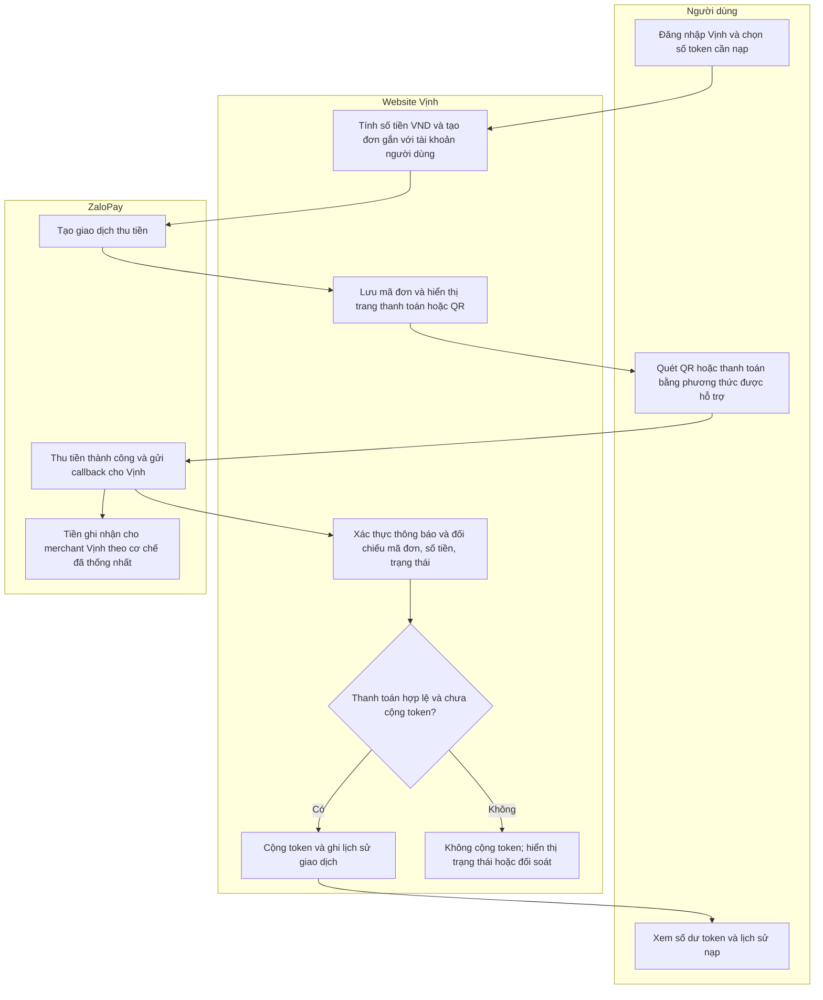
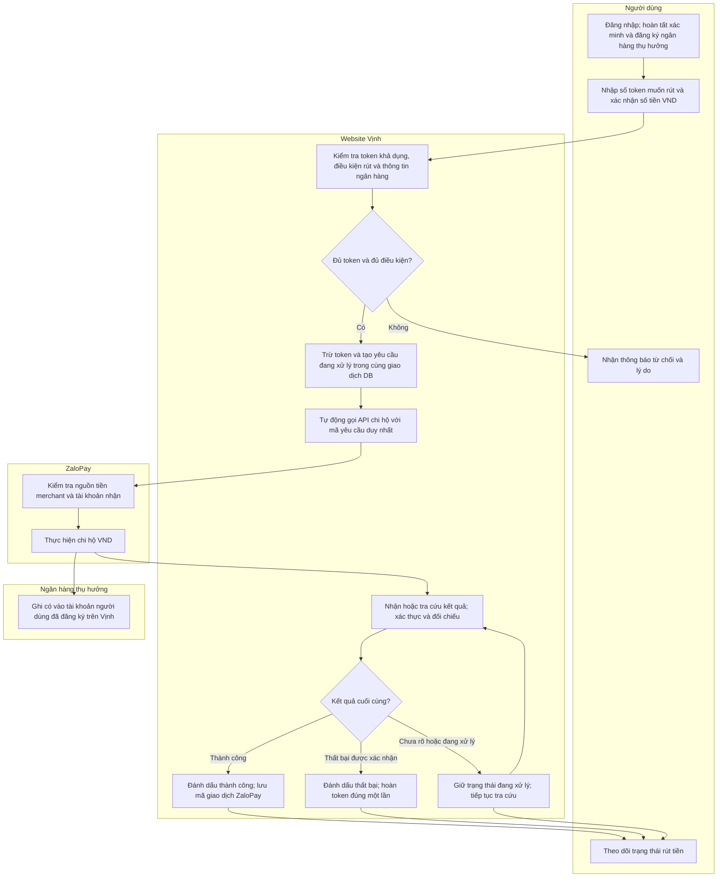

# Vịnh — Luồng nạp token và rút tiền qua ZaloPay

Tài liệu trao đổi giải pháp với ZaloPay, ngày 07/10/2026. Sơ đồ mô tả luồng mong muốn; hiện trạng code được ghi riêng ở cuối.

## Mục tiêu

Website Vịnh nhận thanh toán của người dùng qua QR, chuyển khoản và các phương thức ZaloPay hỗ trợ để quy đổi thành token. Tiền được thu về tài khoản/ví merchant của Vịnh theo giải pháp hai bên thống nhất. Vịnh quản lý số token của từng tài khoản và lịch sử biến động. Khi người dùng rút token, Vịnh kiểm tra điều kiện, trừ số token tương ứng rồi tự động gọi API chi hộ để chuyển VND vào tài khoản ngân hàng đã đăng ký trên Vịnh.

ZaloPay xử lý dòng tiền VND. Vịnh xử lý sổ cái token và quyết định yêu cầu nạp/rút thuộc tài khoản nào. Người dùng không cần thao tác chuyển tiền thủ công với quản trị viên khi rút.

## 1. Luồng nạp token

Mỗi đơn nạp phải liên kết được với ID người dùng trên Vịnh. Chỉ cộng token sau khi server xác nhận thanh toán thành công; việc người dùng quay lại trang Vịnh không đủ để xác nhận đã trả tiền. Callback gửi lại nhiều lần không được cộng token nhiều lần. Đơn chưa có kết quả cần được tra cứu trạng thái để xử lý mất callback, hết hạn hoặc thanh toán bị bỏ dở.

QR/chuyển khoản trong sơ đồ là yêu cầu phương thức thanh toán cần ZaloPay xác nhận. Nếu dùng chuyển khoản, cần mã giao dịch hoặc cơ chế định danh để tự động nhận biết người nạp và đơn nạp.

## 2. Luồng rút token về ngân hàng

Token được trừ trước khi gửi lệnh chi hộ để không thể dùng cùng số dư cho nhiều yêu cầu. Nếu timeout hoặc chưa rõ kết quả, Vịnh giữ yêu cầu đang xử lý và tra cứu theo cùng mã giao dịch; không tự hoàn token hay tạo lệnh chi mới trước khi biết kết quả cuối cùng. Thiếu tiền ở tài khoản merchant là lỗi nguồn chi của Vịnh, cần xử lý riêng với trường hợp người dùng thiếu token.

## 3. Đề nghị ZaloPay thiết kế và xác nhận

1. Giải pháp thu tiền hỗ trợ những loại QR, chuyển khoản và phương thức nào; cách gắn mỗi khoản thu với đơn nạp/người dùng của Vịnh.
2. Tiền thu được ghi nhận vào ví/tài khoản merchant nào. Có thể dùng tiền thu làm nguồn chi hộ trực tiếp hay cần quyết toán/chuyển quỹ/nạp nguồn chi riêng; thời điểm tiền khả dụng.
3. Đăng ký dịch vụ chi hộ ngân hàng tự động, API kiểm tra tài khoản thụ hưởng, danh sách ngân hàng và truy vấn số dư nguồn chi.
4. API tạo lệnh chi, mã giao dịch chống gửi trùng, API tra cứu, cơ chế thông báo kết quả cuối cùng và xử lý timeout.
5. Phí thu/chi, hạn mức, thời gian xử lý, yêu cầu xác minh và quy tắc tên chủ tài khoản nhận. Phí được trừ vào tiền nhận hay do Vịnh thanh toán cần được thống nhất.
6. Định dạng dữ liệu đối soát thu/chi và cách xử lý giao dịch sai số tiền, chậm hoặc thất bại.
